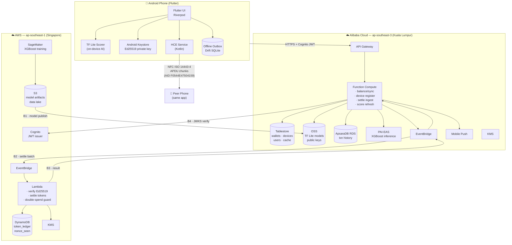

# Touch 'n Go Offline Wallet

> **Pay anywhere. Even when the network can't.**

[](#)
[](#)
[](#)
[](#)
[](#)
[](#)

A Touch 'n Go e-wallet extension that enables **offline peer-to-peer NFC payments** — no internet required. An on-device AI model determines a safe offline spending limit, Ed25519-signed tokens prove the transaction, and everything settles automatically when either party reconnects.

**Hackathon:** TNG Digital FINHACK 2026 &nbsp;|&nbsp; **Track:** Financial Inclusion &nbsp;|&nbsp; **Clouds:** AWS + Alibaba Cloud

---

## The Problem

Cashless adoption stalls when connectivity is unreliable — rural areas, transit underground, packed event venues, and disaster scenarios. A user with a TNG balance still falls back to physical cash because the wallet **cannot transact without a network**. This friction hits hardest for the financially underserved: gig workers, hawkers, students on prepaid data, and rural micro-merchants.

## What We Built

### 1. Offline NFC Payments — Two-tap, Merchant-Initiated

```
TAP 1  Merchant (Aida) ──────────────────────> Payer (Faiz)
       SELECT AID [F0544E47504159]
       PUT-REQUEST ──> payment request delivered to Faiz's phone
                       Pay Confirm screen appears automatically

       [Faiz reviews amount, approves with biometric, JWS is signed]

TAP 2  Payer (Faiz) ───────────────────────> Merchant (Aida)
       PUT-DATA ──> signed Ed25519 JWS token delivered
       GET-ACK  ──> Aida signs sha256(jws) as audit receipt
```

No server call. No internet. Both phones in airplane mode. Settlement happens on reconnect.

### 2. AI Safe Offline Balance

An XGBoost model trained on AWS SageMaker analyzes each user's transaction history and outputs a **safe offline spending limit** — how much of their cached balance they can spend without overdraft risk. The model is converted to TF Lite and runs fully on-device (< 2 MB). Alibaba PAI-EAS serves online refresh. The limit is recomputed every sync.

### 3. Cryptographic Settlement

Every offline payment produces an **Ed25519-signed JWS token**. The private key lives in the Android Keystore — never in Dart or SharedPreferences. Biometric authorization is required per signing. When either party reconnects, tokens are submitted to the settlement service, which performs:

- Ed25519 signature verification
- **Idempotent double-spend guard** — DynamoDB conditional put on `nonce_seen`
- Balance debit on Alibaba Tablestore
- Push notification to both parties

### 4. Multi-Cloud Architecture

| Layer | AWS | Alibaba Cloud |
|---|---|---|
| ML training | SageMaker + S3 | — |
| ML runtime | — | PAI-EAS + OSS |
| Token ledger | DynamoDB + Lambda | — |
| Wallet balance | — | Tablestore + FC |
| Auth | Cognito + KMS | — |
| User PII | — | RDS KL + Tablestore |
| Event bridge | EventBridge | EventBridge |

Cross-cloud calls are mTLS + HMAC body-signed. PII never leaves Alibaba Cloud KL region.

---

## Architecture



**Cross-cloud boundaries:** B1 model publish (AWS S3 → Alibaba OSS) · B2 settlement request (Alibaba → AWS) · B3 settlement result (AWS → Alibaba) · B4 JWT verification (Alibaba FC → AWS Cognito JWKS) · All bridge calls are mTLS + HMAC body-signed.

---

## Tech Stack

| Area | Technology |
|---|---|
| Mobile | Flutter (Android), Kotlin HCE, Android Keystore |
| Cryptography | Ed25519 (API 33+), JWS (`EdDSA` / `tng-offline-tx+jws`) |
| NFC | Android HCE — AID `F0544E47504159` |
| ML | XGBoost → TF Lite via Treelite, on-device inference |
| Backend | Python (AWS Lambda + Alibaba FC) |
| Infra | Terraform (AWS) + Terraform/ROS (Alibaba) |
| State | Flutter Riverpod, Drift (local SQLite) |

---

## Repository Layout

```
.
├── lib/                  # Flutter app (Riverpod, go_router)
│   ├── features/         # home, pay, receive, request, history …
│   ├── domain/           # credit scorer, offline pay policy
│   └── core/             # crypto, NFC platform channel, identity
├── android/              # Kotlin HCE service + Keystore platform channel
├── backend/              # AWS Lambda handlers + Alibaba FC handlers
├── ml/                   # SageMaker training, synthetic data, EAS server
├── infra/
│   ├── aws/              # Terraform: DynamoDB, Lambda, Cognito, KMS, EventBridge
│   └── alibaba/          # Terraform: FC, Tablestore, OSS, RDS, PAI-EAS
├── test/                 # Flutter unit + widget tests
├── docs/                 # Full spec (see index below)
└── dist/                 # Pre-built web demo
```

---

## Getting Started

### Prerequisites

- Flutter 3.x with Android SDK (minSdk 26; Ed25519 requires API 33+)
- Python 3.11+
- Two Android devices or emulators for NFC testing

### Run the local backend

```bash
python3 backend/server.py
```

### Run the Flutter app

```bash
flutter run \
  --dart-define=API_BASE_URL=http://10.0.2.2:3000/v1 \
  --dart-define=API_BEARER_TOKEN=demo-token \
  --dart-define=DEVICE_ID=did:tng:device:demo
```

### Run tests

```bash
flutter test
python3 -m pytest backend/tests tests
(cd android && ./gradlew app:compileDebugKotlin)
```

### Deploy to cloud

See [docs/13-deployment.md](docs/13-deployment.md) for the full Terraform workflow, environment variables, secrets, and current deployment status.

---

## User Flows

### Merchant — Request Payment (Tap 1)

1. Open **Request** tab → enter amount and memo → tap **Request via NFC**
2. Hold phone to payer's phone — payment request transfers over NFC
3. Screen switches to **Waiting for payer…**

### Payer — Approve and Pay (Tap 2)

1. Pay Confirm screen appears automatically after tap 1
2. Review amount and merchant — tap **Approve** → biometric prompt
3. Hold phone to merchant's phone — signed JWS transfers over NFC
4. Receipt shown immediately; settlement queued for reconnect

### Settlement on Reconnect

Both parties receive a push notification confirming the settled balance once either device goes online.

---

## Security

| Mechanism | Implementation |
|---|---|
| Key storage | Android Keystore, `setUserAuthenticationRequired(true)` |
| Signing | Ed25519 per-transaction, biometric-gated (except ≤ RM 5) |
| Double-spend | DynamoDB conditional put on `nonce_seen` — single path, no bypass |
| Token expiry | JWS valid for 72 h; payment request TTL 300 s |
| Cross-cloud auth | mTLS + HMAC body signing on all bridge webhooks |
| KYC caps | Enforced server-side only — never trust client-claimed tier |
| ML model OTA | Sigstore signature verified before swap; reject on mismatch |

KYC spending tiers:

| Tier | Per token | Per 24 h |
|---|---|---|
| 0 — Phone OTP | RM 20 | RM 50 |
| 1 — IC last 4 | RM 50 | RM 150 |
| 2 — eKYC | RM 250 | RM 500 |

Full threat model: [docs/10-security-threat-model.md](docs/10-security-threat-model.md)

---

## Documentation

| Doc | Covers |
|---|---|
| [00 — Overview](docs/00-overview.md) | Problem, value prop, success metrics, judging map |
| [01 — Architecture](docs/01-architecture.md) | System diagram, multi-cloud split, data flows |
| [02 — User Flows](docs/02-user-flows.md) | Screens, wireframes, two-tap walkthrough |
| [03 — Token Protocol](docs/03-token-protocol.md) | JWS schema, Ed25519, NFC APDU, anti-replay |
| [04 — Credit Score ML](docs/04-credit-score-ml.md) | Features, model, training, OTA, on-device inference |
| [05 — AWS Services](docs/05-aws-services.md) | SageMaker, Lambda, DynamoDB, Cognito, KMS, EventBridge |
| [06 — Alibaba Services](docs/06-alibaba-services.md) | PAI-EAS, OSS, FC, Tablestore, RDS, KMS, Mobile Push |
| [07 — Mobile App](docs/07-mobile-app.md) | Flutter layout, HCE, key gen, Drift schema |
| [08 — Backend API](docs/08-backend-api.md) | REST contracts and JSON schemas |
| [09 — Data Model](docs/09-data-model.md) | All datastore schemas and key designs |
| [10 — Security](docs/10-security-threat-model.md) | STRIDE table, key lifecycle, KYC tiers |
| [11 — Demo & Test Plan](docs/11-demo-and-test-plan.md) | 4-min demo script, TS-01..TS-21 test scenarios |
| [12 — Build Tasks](docs/12-build-tasks.md) | Engineering task list, DoD, dependency DAG |
| [13 — Deployment](docs/13-deployment.md) | IaC layout, env vars, secrets, CI, rollback |

---

## Current Status

| Area | Status |
|---|---|
| Flutter offline request/pay/receive flow | Working locally |
| Android NFC + Keystore path | Working locally |
| Local backend settlement + replay protection | Verified (`pytest`) |
| AWS Lambda + API Gateway deploy | Deployable via Terraform |
| Alibaba FC + HTTP trigger deploy | Deployable via Terraform |
| Alibaba PAI-EAS | Needs cloud apply |
| Live AWS ↔ Alibaba smoke test | Pending |
| Two-device NFC dry run vs deployed backend | Pending |

---

## Team

Built at TNG Digital FINHACK 2026 for the **Financial Inclusion** track.

---

*See [Idea.md](Idea.md) for the original brainstorm and [HackathonInfo.md](HackathonInfo.md) for judging criteria.*
