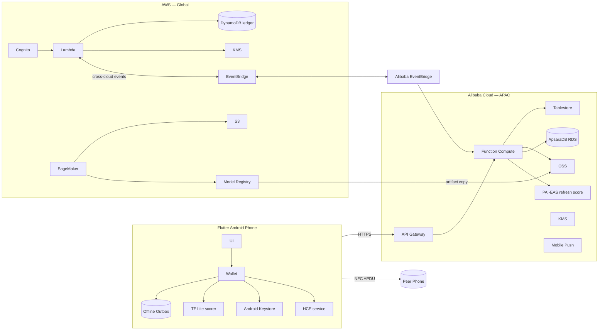

# Architecture

## 1. High-level system diagram (ASCII)

```
                         ┌─────────────────────────────────────────────────┐
                         │                MOBILE (Flutter Android)         │
                         │                                                 │
                         │  ┌────────┐  ┌──────────┐  ┌─────────────────┐  │
                         │  │  UI    │──│ Wallet   │──│ Offline Outbox  │  │
                         │  │ Layer  │  │ Service  │  │ (Drift sqlite)  │  │
                         │  └────────┘  └──────────┘  └─────────────────┘  │
                         │       │           │                │            │
                         │       │     ┌─────────┐      ┌─────────────┐    │
                         │       │     │ TF Lite │      │ HCE service │    │
                         │       │     │ scorer  │      │ (Kotlin)    │    │
                         │       │     └─────────┘      └──────┬──────┘    │
                         │       │                             │           │
                         │       │   ┌─────────────────┐       │           │
                         │       └──>│ Android         │       │           │
                         │           │ Keystore        │       │           │
                         │           │ (Ed25519 priv)  │       │           │
                         │           └─────────────────┘       │           │
                         └────────────────┬────────────────────┼───────────┘
                                          │                    │
                                          │  HTTPS (mTLS)      │  NFC ISO 14443-4 APDU
                                          │                    │  (peer device)
                                          ▼                    ▼
              ┌──────────────────────────────────────┐    ┌──────────────────┐
              │      ALIBABA CLOUD (ap-southeast)    │    │  PEER PHONE      │
              │                                      │    │  (same app)      │
              │  ┌────────────┐  ┌────────────────┐  │    └──────────────────┘
              │  │ API        │─>│ Function       │  │
              │  │ Gateway    │  │ Compute        │  │
              │  └────────────┘  │ - balance/sync │  │
              │                  │ - device reg   │  │
              │                  │ - score refresh│  │
              │                  └───────┬────────┘  │
              │                          │           │
              │  ┌────────────┐  ┌───────▼────────┐  │
              │  │ PAI-EAS    │  │ Tablestore     │  │
              │  │ (refresh   │  │ users/devices/ │  │
              │  │  score)    │  │ wallets/cache  │  │
              │  └────────────┘  └────────────────┘  │
              │                                      │
              │  ┌────────────┐  ┌────────────────┐  │
              │  │ OSS        │  │ ApsaraDB RDS   │  │
              │  │ models +   │  │ settled txn    │  │
              │  │ pubkeys    │  │ history        │  │
              │  └────────────┘  └────────────────┘  │
              │                                      │
              │  ┌────────────┐  ┌────────────────┐  │
              │  │ KMS        │  │ Mobile Push    │  │
              │  └────────────┘  └────────────────┘  │
              └──────────────────┬───────────────────┘
                                 │
                  Cross-cloud event bus (EventBridge ↔ EventBridge)
                                 │
              ┌──────────────────▼───────────────────┐
              │            AWS (us-east + ap-)       │
              │                                      │
              │  ┌────────────┐  ┌────────────────┐  │
              │  │ Cognito    │  │ Lambda         │  │
              │  │ (JWT)      │  │ - settle       │  │
              │  └────────────┘  │ - dispute      │  │
              │                  │ - fraud-score  │  │
              │                  └───────┬────────┘  │
              │                          │           │
              │  ┌────────────┐  ┌───────▼────────┐  │
              │  │ SageMaker  │  │ DynamoDB       │  │
              │  │ training   │  │ token_ledger / │  │
              │  │ + registry │  │ idempotency /  │  │
              │  │            │  │ nonce_seen     │  │
              │  └─────┬──────┘  └────────────────┘  │
              │        │                             │
              │  ┌─────▼──────┐  ┌────────────────┐  │
              │  │ S3         │  │ KMS            │  │
              │  │ data lake  │  │ envelope keys  │  │
              │  │ + models   │  └────────────────┘  │
              │  └────────────┘                      │
              │                                      │
              │  ┌────────────┐  ┌────────────────┐  │
              │  │ EventBridge│  │ CloudWatch     │  │
              │  └────────────┘  └────────────────┘  │
              └──────────────────────────────────────┘
```

Mermaid version (renders on GitHub):



## 2. Component list

| Component | Owner doc | Tech |
|---|---|---|
| Flutter mobile app | [docs/07-mobile-app.md](07-mobile-app.md) | Flutter, Riverpod, Drift, tflite_flutter |
| HCE NFC service | [docs/07-mobile-app.md](07-mobile-app.md) | Android Kotlin |
| Token signing | [docs/03-token-protocol.md](03-token-protocol.md) | Ed25519 via Keystore + JWS |
| Wallet API | [docs/08-backend-api.md](08-backend-api.md) | Alibaba Function Compute (Node/Python) |
| Settlement workers | [docs/08-backend-api.md](08-backend-api.md) | AWS Lambda (Python) |
| Refresh-score endpoint | [docs/04-credit-score-ml.md](04-credit-score-ml.md) | Alibaba PAI-EAS (Flask container) |
| Training pipeline | [docs/04-credit-score-ml.md](04-credit-score-ml.md) | AWS SageMaker (XGBoost → TF Lite) |
| Token ledger | [docs/09-data-model.md](09-data-model.md) | AWS DynamoDB |
| Wallet/user state | [docs/09-data-model.md](09-data-model.md) | Alibaba Tablestore |
| Settled history | [docs/09-data-model.md](09-data-model.md) | Alibaba ApsaraDB RDS (MySQL) |
| Model + pubkey distribution | [docs/06-alibaba-services.md](06-alibaba-services.md) | Alibaba OSS |
| Auth | [docs/05-aws-services.md](05-aws-services.md) | AWS Cognito (JWT) |
| Push notifications | [docs/06-alibaba-services.md](06-alibaba-services.md) | Alibaba Mobile Push |
| Cross-cloud events | this doc §4 | AWS EventBridge ↔ Alibaba EventBridge |

## 3. Multi-cloud split (single source of truth)

| Workload | Cloud | Why |
|---|---|---|
| ML training, feature store, model registry | **AWS** SageMaker, S3 | Mature ML ops; latency-insensitive batch |
| Synthetic data lake | **AWS** S3 | Co-located with training |
| Settlement ledger + idempotency | **AWS** DynamoDB + Lambda | Strong key-level consistency, infinite scale |
| User auth (JWT issuer) | **AWS** Cognito | Off-the-shelf; Lambda-friendly |
| Cross-cloud event bus | **AWS** EventBridge ↔ **Alibaba** EventBridge | Decoupled async fan-out |
| Wallet API + balance sync | **Alibaba** Function Compute, API Gateway | APAC latency, regional data residency |
| Online refresh-score inference | **Alibaba** PAI-EAS | Low-latency APAC inference |
| User/device/wallet state | **Alibaba** Tablestore | Regional reads from mobile |
| Settled txn history (analytics OLTP) | **Alibaba** ApsaraDB RDS | Reporting + KYC near user data |
| Device pubkey directory + TF Lite model bin | **Alibaba** OSS | Edge-near distribution |
| Mobile push | **Alibaba** Mobile Push | APAC reach (FCM less reliable in target geos) |
| Per-device cert issuance | **Alibaba** KMS | Asia residency for keys |
| Settlement signing-key envelope | **AWS** KMS | Co-located with ledger |

## 4. AWS↔Alibaba boundary calls (auditable)

These are the *purposeful* cross-cloud interactions. Each row is justified, not cosmetic.

| # | Direction | Trigger | Payload | Why this boundary exists |
|---|---|---|---|---|
| B1 | AWS S3 (model artifact) → Alibaba OSS | New model version published in SageMaker registry | `model.tflite`, `model.json` (sigstore signature), `score_card.json` | Training is on AWS; mobile/edge distribution is on Alibaba. Cross-cloud copy keeps origin authoritative. |
| B2 | Alibaba EventBridge → AWS EventBridge | New settlement batch ready (mobile uploaded tokens) | `{deviceId, batchId, tokenCount, sha256}` | Wallet API runs on Alibaba (APAC) but the ledger is on AWS. Async event hands off. |
| B3 | AWS Lambda (settle) → Alibaba EventBridge | Settlement complete | `{txId, status, settledAt}` | Lets Alibaba update wallet balance + push notify the user. |
| B4 | Alibaba PAI-EAS → AWS S3 | Cold-start model load | Read `s3://.../models/credit/v{n}/model.pkl` | EAS pulls from authoritative S3 origin (mirrored in OSS for hot path). |
| B5 | Alibaba FC → AWS Cognito | JWT verification (JWKS) | Public JWKS fetch | Auth federated; FC validates Cognito-issued JWT. |
| B6 | AWS Lambda (fraud-score) → Alibaba RDS (read replica via VPN) | Look up KYC tier | `userId` | Settlement may need user-tier check before approving. |

All boundary calls are JSON over HTTPS. B2/B3 use a thin proxy Lambda + Alibaba FC handler since native EventBridge cross-cloud routing is not first-class — see [docs/05-aws-services.md](05-aws-services.md) §EventBridge bridge.

## 5. Data flows

### 5.1 Online balance sync
```
Mobile (online) ──GET /wallet/balance──> Alibaba API GW ──> FC
FC ──> Tablestore (read wallet) ──> response
Mobile caches balance + ts in Drift; updates "confidence" indicator.
```
Cache TTL = 10 min (per `Idea.md`). Beyond that, the AI safe-offline-balance kicks in.

### 5.2 Offline pay (Sender offline → Receiver offline)
```
Sender app: build token {tx_id, sender_pub, receiver_pub, amount, iat, exp, nonce}
       ──> sign with Ed25519 (Keystore)
       ──> JWS string
       ──> NFC APDU SELECT AID then DATA chunks to receiver
Receiver app: verify signature with sender_pub from cached pubkey directory
              (or accept-and-defer if pubkey unknown — settled later)
            ──> store in inbox (Drift)
            ──> show "Received RM X.XX (pending settlement)"
Both update local "safe offline balance" (sender − amount, receiver advisory + amount).
```
See [docs/03-token-protocol.md](03-token-protocol.md) for APDU details.

### 5.3 Back-online settlement
```
Either party comes online:
Mobile ──POST /tokens/settle (JSON list of JWS)──> Alibaba API GW ──> FC
FC validates schema, forwards via Alibaba EventBridge (B2) ──> AWS EventBridge ──> Lambda
Lambda:
  for each token:
    verify JWS signature (DynamoDB cache of pubkeys)
    check nonce_seen (idempotency); if seen → reject as double-spend
    write to token_ledger (atomic conditional put)
    publish settlement event back via B3
Lambda returns {settled[], rejected[]}
Alibaba FC receives event, updates Tablestore wallet balances, RDS history,
  triggers Mobile Push to both parties.
```

### 5.4 Refresh credit score
```
Mobile (online): POST /score/refresh with recent on-device feature vector
Alibaba API GW ──> FC ──> PAI-EAS endpoint ──> safe_offline_balance
FC returns score + policy version; mobile updates UI.

Periodically (weekly):
SageMaker training job in AWS retrains on aggregated history → exports TF Lite
Pipeline copies model.tflite to Alibaba OSS (B1) → bumps policy_version
Mobile gets push notification (Alibaba Mobile Push) → downloads new model on next online
```

## 6. Failure modes (sketch — full set in [docs/10-security-threat-model.md](10-security-threat-model.md))

| Mode | Behavior |
|---|---|
| Network down at sender | Offline pay still works; tokens queue in outbox. |
| Network down at receiver | Tokens accepted optimistically; verified at settlement. |
| Both offline forever | Tokens have `exp` claim — server rejects after expiry. |
| Sender phone lost after offline pay | Receiver still settles using the signed token; sender's device key may be revoked but the *already-signed* token is valid until exp. |
| Double spend (two receivers, one nonce) | Settlement uses conditional-put on `nonce_seen`; second one fails. |
| Tampered amount | JWS signature verification fails; rejected. |
| Stale model | Policy version pinned in JWS via header; settlement allows tokens against any active policy. |

## 7. Non-functional requirements

| NFR | Target |
|---|---|
| End-to-end NFC tap | < 2 s (sign + APDU exchange) |
| Online balance fetch p95 | < 800 ms |
| Settlement throughput | 200 tx/s sustained per Lambda concurrency unit |
| Mobile cold-start | < 3 s |
| Encryption in transit | TLS 1.3 everywhere |
| Encryption at rest | KMS-managed in both clouds |
| Crash-free sessions | ≥ 99.5% in demo |
